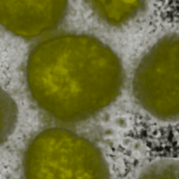
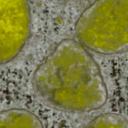
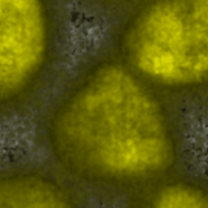
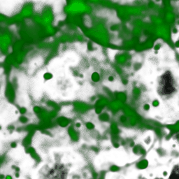
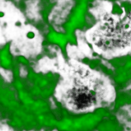
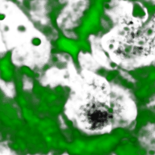
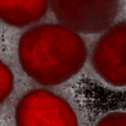
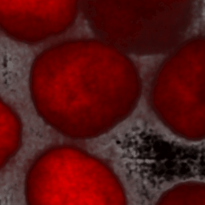
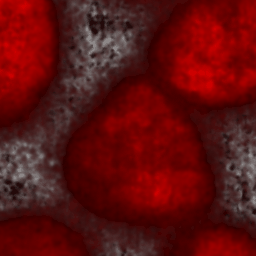
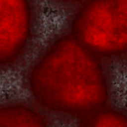

# CoVo3Diffusion

**Consistency Preserved 3D Volume Reconstruction from Sparse 2D Slices  
via a Diffusion Framework for Volumetric Optical Imaging**

Eunjung Jo, Hyun Jung Lee, Minjoo Lim, Young-Han Son, Tae-Eui Kam*

# Results

 

## DNA

 

| Sample 1 Ours | Sample 1 GT | Sample 2 Ours | Sample 2 GT |
|---------------|-------------|---------------|-------------|
|  |  |  |  |

  

## Membrane

 

### Membrane sample 1

 

| Ours | GT |
|------|----|
|  |  |

  

### Membrane sample 2

 

| Ours | GT |
|------|----|
|  |  |

  

## Structure

 

### Structure sample 1

 

| Ours | GT |
|------|----|
|  |  |

  

### Structure sample 2

 

| Ours | GT |
|------|----|
|  |  |
